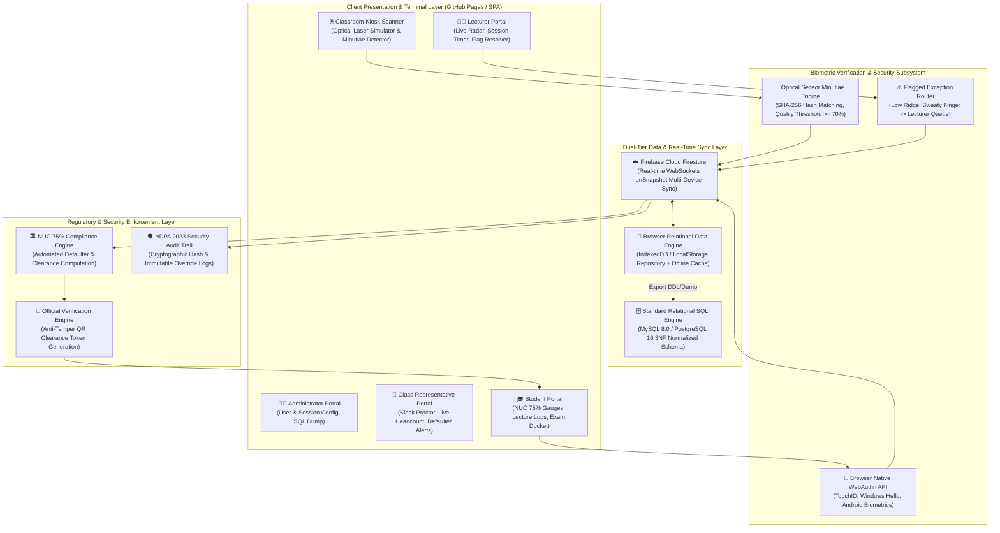
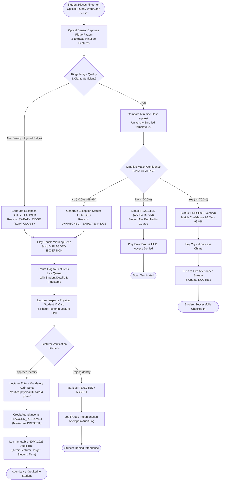
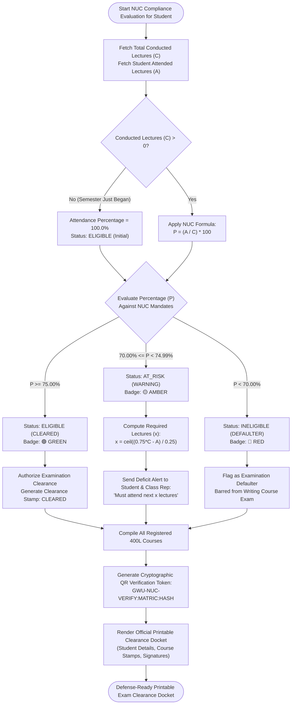
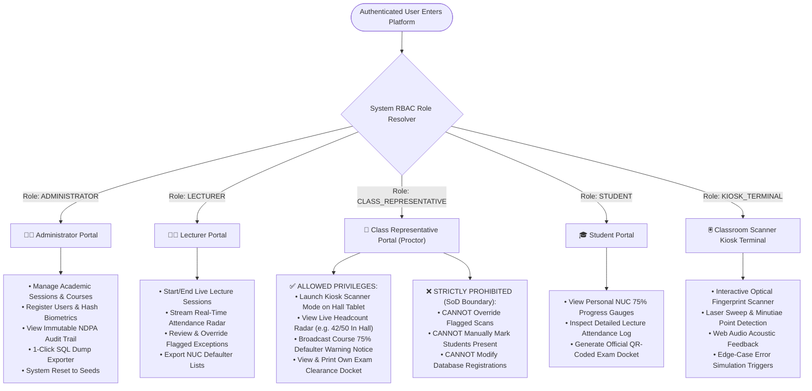
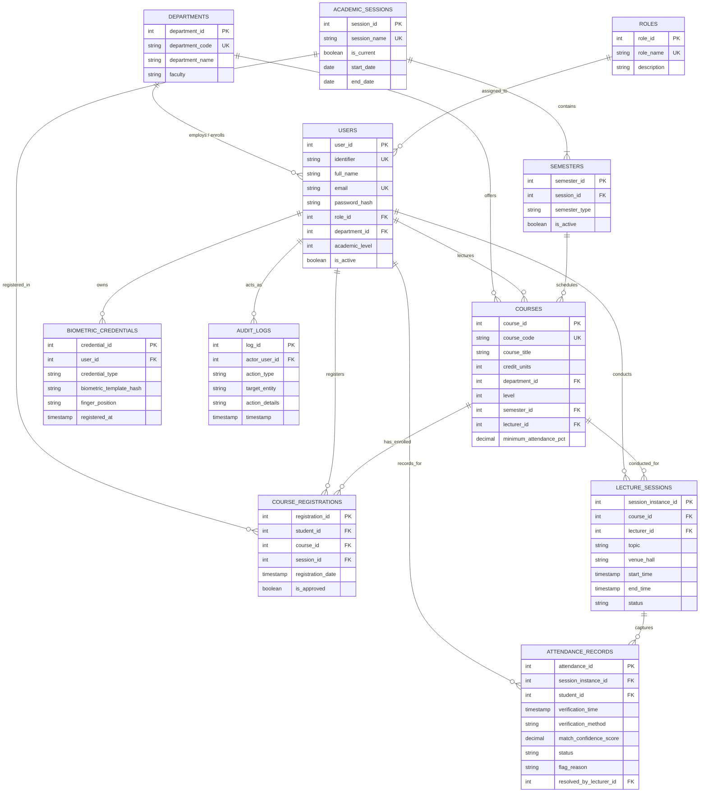

# Global Wealth University — SmartBio Complete Mermaid Diagrams Gallery

All system architecture, flowcharts, RBAC matrices, ERDs, and sequence diagrams are compiled below. These diagrams render automatically on GitHub and can be edited directly on **[https://mermaid.live](https://mermaid.live)**.

---

## 1. System Architecture (`01_system_architecture.mmd`)

---

## 2. Biometric Verification & Flagged Exception Workflow (`02_biometric_and_flagging_workflow.mmd`)

---

## 3. NUC 75% Rule Compliance & Clearance Algorithm (`03_nuc_75_compliance_flow.mmd`)

---

## 4. Role-Based Access Control (RBAC) & Class Rep Matrix (`04_rbac_and_class_rep_flow.mmd`)

---

## 5. 3NF Relational Entity-Relationship Diagram (`05_entity_relationship_diagram.mmd`)

