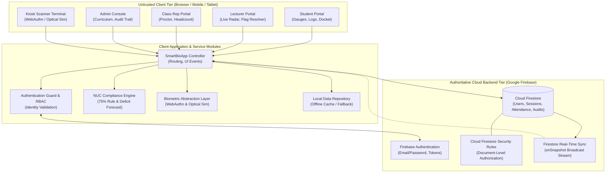
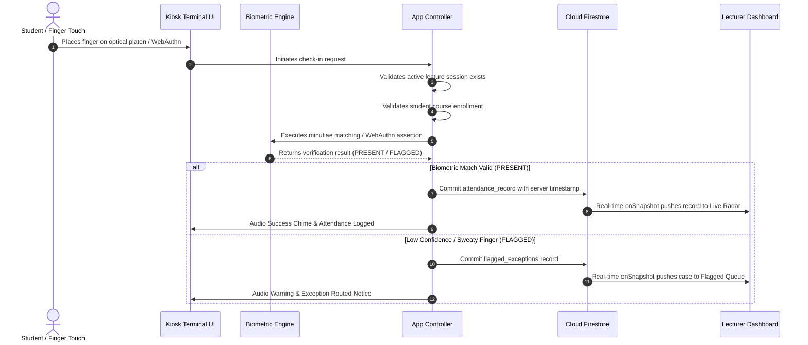
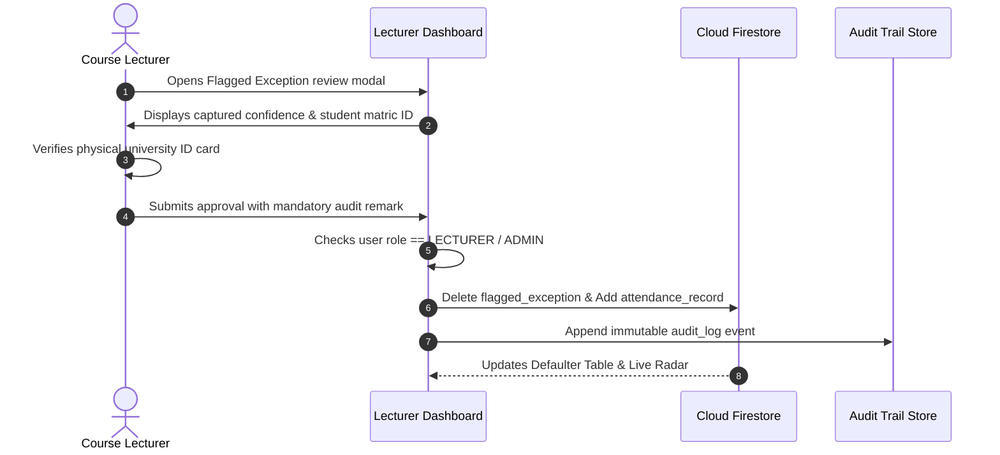

# SmartBio Attendance System — Technical Architecture Specification

## 1. High-Level Architectural Topology

The **SmartBio Attendance System** is architectured as a multi-tier, cloud-synchronized Single-Page Application (SPA) designed to run with zero build dependencies while providing real-time data propagation and strict role-based access control.

---

## 2. Core Subsystems & Service Modules

### 2.1 Authentication & RBAC Module (`js/app.js`, `js/firebase-config.js`)
- **Authoritative Identity Provider**: Connects to Firebase Authentication via `signInWithEmailAndPassword` and `createUserWithEmailAndPassword`.
- **RBAC Policy Guard**: Enforces user capabilities based strictly on the authenticated account's verified role (`ADMIN`, `LECTURER`, `CLASS_REP`, `STUDENT`).
- **Session Lifecycle**: Handles login validation, identity persistence, and complete state cleanup on sign-out.

### 2.2 Biometric Abstraction Layer (`js/biometric.js`)
- **`BiometricProvider`**: Abstract base class defining `enroll()` and `verify()` contracts.
- **`WebAuthnProvider`**: Native FIDO2 asymmetric cryptographic passkey implementation. Calls `navigator.credentials.create()` for credential generation and `navigator.credentials.get()` for signed challenge assertions.
- **`SimulatedFingerprintProvider`**: Defense simulation provider modeling optical minutiae capture, hardware latencies (1.0s), and edge case scenarios (*Normal, Sweaty Ridge, Injured Finger, Non-Enrolled*).

### 2.3 NUC 75% Compliance & Deficit Forecasting Engine (`js/compliance.js`)
- **Statutory Computation**:
  $$\text{Compliance } (\%) = \left(\frac{\text{Classes Attended}}{\text{Total Sessions Held}}\right) \times 100$$
- **Classification Thresholds**:
  - $\ge 75.0\%$: `ELIGIBLE` (Cleared for semester examinations)
  - $70.0\% - 74.99\%$: `AT_RISK` (Warning status; below final threshold)
  - $< 70.0\%$: `INELIGIBLE` (Barred; Defaulter status)
- **Deficit Forecast Mathematical Model**:
  $$\text{Classes Needed } (x) = \max\left(0, \left\lceil \frac{0.75 \times \text{Held} - \text{Attended}}{0.25} \right\rceil\right)$$

### 2.4 Digital Examination Clearance Docket & Verification
- **Verifiable Token Minting**: Algorithmically constructs signed tokens:
  $$\text{Token} = \text{GWU-NUC-V2}.\langle\text{studentId}\rangle.\langle\text{timestamp}\rangle.\langle\text{HMAC-Signature}\rangle$$
- **Dynamic Status Re-evaluation**: The verification engine re-computes current student compliance from authoritative session records to return `VALID`, `REVOKED`, `EXPIRED`, or `TAMPERED`.

### 2.5 Real-Time Synchronization Engine (`js/firebase-config.js`)
- Uses Cloud Firestore listeners (`onSnapshot`) to push attendance check-ins, active session status, and flagged exceptions across devices in near-real-time without full page reloads.

---

## 3. Data Flow Diagrams

### 3.1 Attendance Check-In Sequence

### 3.2 Flagged Exception Resolution (Separation of Duties)

---

## 4. Technical Stack Matrix

| Layer | Technology | Implementation Details |
| :--- | :--- | :--- |
| **Frontend UI** | HTML5, Vanilla CSS3 (Custom Glassmorphism Design System) | Zero-build, responsive across mobile, tablet kiosks, and desktop. |
| **Client Controller** | Modern ES6+ JavaScript | Modular OOP architecture, async/await pipelines, Web Audio API. |
| **Authentication** | Firebase Authentication / WebAuthn API (FIDO2) | Email/Password token sessions + Hardware biometric passkeys. |
| **Authoritative DB** | Google Cloud Firestore (NoSQL Document Store) | Real-time multi-device sync with locked `firestore.rules`. |
| **Local Cache** | HTML5 LocalStorage API | Non-authoritative transient cache for offline UI responsiveness. |
| **Audio Synthesizer** | Web Audio API (`AudioContext`) | Synthetic acoustic feedback (laser chirp, success chime, error buzz). |
