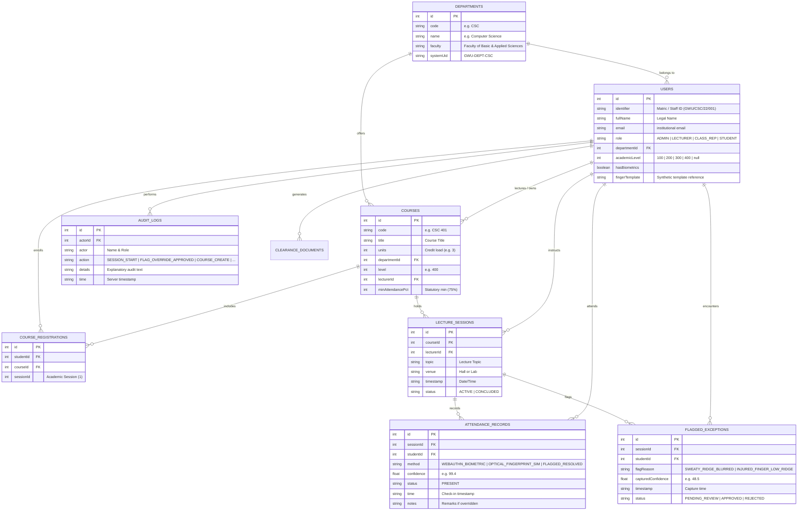

# SmartBio Attendance System — Data Model & Schema Specification

## 1. Entity-Relationship Overview

The **SmartBio Attendance System** maintains a normalized data schema with strict relational integrity between university entities, lecture sessions, biometric check-ins, exception reviews, and audit events.

---

## 2. Cloud Firestore Collections Specification

### 2.1 Collection: `/users`
Stores academic stakeholder profiles, authentication mappings, and biometric registration statuses.

| Field Name | Data Type | Description |
| :--- | :--- | :--- |
| `id` | `number` / `string` | Primary user identifier (e.g. `4`). |
| `identifier` | `string` | Institutional ID / Matric No (e.g. `GWU/CSC/22/001`). |
| `fullName` | `string` | Full legal name (e.g. `Benedict Uchechukwu`). |
| `email` | `string` | Verified university email (e.g. `b.uche@student.gwu.edu`). |
| `role` | `string` | Strict security role: `ADMIN`, `LECTURER`, `CLASS_REP`, `STUDENT`. |
| `departmentId`| `number` | Foreign key referencing `/departments`. |
| `academicLevel`| `number` / `null` | Undergraduate level: `100`, `200`, `300`, `400` (or `null` for staff). |
| `hasBiometrics`| `boolean` | `true` if WebAuthn/optical template is enrolled; `false` otherwise. |
| `fingerTemplate`| `string` / `null` | Synthetic template reference (e.g. `SIMULATED_BIO_TEMPLATE_BENEDICT_001`). |

---

### 2.2 Collection: `/courses`
Stores the university curriculum catalog and faculty course ownership.

| Field Name | Data Type | Description |
| :--- | :--- | :--- |
| `id` | `number` | Course identifier. |
| `code` | `string` | Course code (e.g. `CSC 401`). |
| `title` | `string` | Course title (e.g. `Advanced Software Engineering & Architecture`). |
| `units` | `number` | Credit unit load (e.g. `3`). |
| `departmentId` | `number` | Department offering the course. |
| `level` | `number` | Academic cohort level (e.g. `400`). |
| `lecturerId` | `number` | User ID of the assigned Course Lecturer. |
| `minAttendancePct` | `number` | NUC statutory minimum percentage (default: `75`). |

---

### 2.3 Collection: `/lecture_sessions`
Represents individual conducted lecture classes.

| Field Name | Data Type | Description |
| :--- | :--- | :--- |
| `id` | `number` / `string` | Session epoch identifier. |
| `courseId` | `number` | Foreign key referencing `/courses`. |
| `lecturerId` | `number` | User ID of the instructor who initiated the session. |
| `topic` | `string` | Topic delivered during the lecture. |
| `venue` | `string` | Physical lecture hall (e.g. `ICT Hall A`). |
| `timestamp` | `string` | Date and time string. |
| `status` | `string` | Session lifecycle state: `ACTIVE` or `CONCLUDED`. |

---

### 2.4 Collection: `/attendance_records`
Authoritative attendance ledger. Enforces server-side idempotency (`sessionId` + `studentId` uniqueness).

| Field Name | Data Type | Description |
| :--- | :--- | :--- |
| `id` | `number` / `string` | Unique record transaction ID. |
| `sessionId` | `number` | Lecture session ID. |
| `studentId` | `number` | Enrolled student ID. |
| `method` | `string` | Verification method: `WEBAUTHN_BIOMETRIC`, `OPTICAL_FINGERPRINT_SIM`, `FLAGGED_RESOLVED`. |
| `confidence` | `number` | Matching confidence score (e.g. `99.4%`). |
| `status` | `string` | Attendance status: `PRESENT`. |
| `time` | `string` | Verified check-in time. |
| `notes` | `string` | Physical verification note if resolved from exception queue. |

---

### 2.5 Collection: `/flagged_exceptions`
Queue of degraded, sweaty, or injured biometric scans awaiting physical lecturer verification.

| Field Name | Data Type | Description |
| :--- | :--- | :--- |
| `id` | `number` | Flag exception ID. |
| `sessionId` | `number` | Active lecture session where exception occurred. |
| `studentId` | `number` | Unmatched student ID. |
| `flagReason` | `string` | `SWEATY_RIDGE_BLURRED` or `INJURED_FINGER_LOW_RIDGE`. |
| `capturedConfidence`| `number` | Low confidence score captured (e.g. `48.5%`). |
| `timestamp` | `string` | Time of scan attempt. |
| `status` | `string` | Review state: `PENDING_REVIEW`, `APPROVED`, `REJECTED`. |

---

### 2.6 Collection: `/audit_logs`
Immutable, append-only NDPA 2023 audit trail.

| Field Name | Data Type | Description |
| :--- | :--- | :--- |
| `id` | `number` | Unique sequential audit ID. |
| `actorId` | `number` / `null` | User ID of the actor initiating the operation. |
| `actor` | `string` | Full name and role of the actor. |
| `action` | `string` | Audit action code (`SESSION_START`, `FLAG_OVERRIDE_APPROVED`, `COURSE_OWNERSHIP_TRANSFER`, `CLOUD_DATABASE_SEED`, etc.). |
| `details` | `string` | Human-readable explanation of the state modification. |
| `time` | `string` | Timestamp of event generation. |
